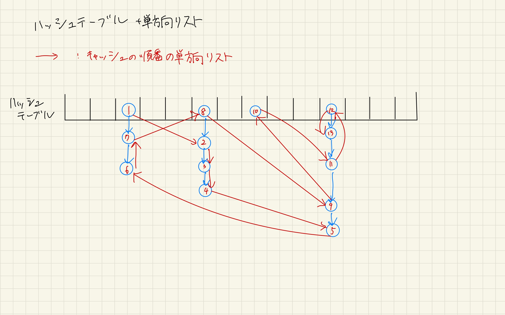

# 宿題３

- 最も直近にアクセスされたページ上位 X 個をキャッシュしておくアルゴリズムを考える

## 解答

## メモ

ハッシュテーブルで使っている単方向リストに加えて、もう一つ単方向リストをもつのはどうか？
↓ 実装としては元々あった`Item`に`next_cache`を追加する

```python
class Item:
    def __init__(self, key, value, next, next_cache):
        assert type(key) == str
        self.key = key
        self.value = value
        self.next = next
        self.next_cache = next
```

イメージ画像：


検索、追加の動作：

- 検索: ハッシュテーブルを使って検索
- 追加:
    1. すでにページが存在しているかを確かめる(検索なのでO(1))
    1. 存在していなければリストの最後尾に追加して、先頭を消す？  
        （ハッシュテーブルのインスタンス変数として、リストの先頭と最後尾のポインタを持っておけば、その二つだけ更新すればOK）
    1. 存在していれば、存在しているページをキャッシュの単方向リストから削除して、リストの最後尾に追加する。
        （存在しているページを探すのにO(1)、単方向リストから削除・リストの最後尾に追加はO(1)）

もしかしてこれでいける……？？
