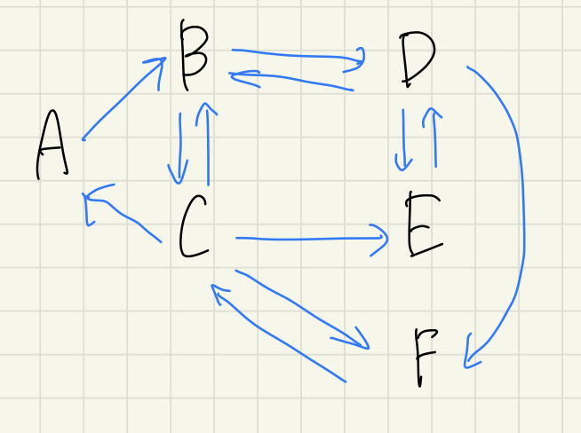

# 問題１

- `find_shortest_path()`関数を書いて、あるページから別のページへの最短経路を求める

## 実行方法

```bash
# smallでテスト
% python lec4/q1/index.py
# small
% python lec4/q1/index.py ./lec4/wikipedia_dataset/pages_small.txt lec4/wikipedia_dataset/links_small.txt
# medium
% python lec4/q1/index.py ./lec4/wikipedia_dataset/pages_medium.txt lec4/wikipedia_dataset/links_medium.txt
# large
% python lec4/q1/index.py ./lec4/wikipedia_dataset/pages_large.txt lec4/wikipedia_dataset/links_large.txt

```

## 方針

アイデア：
queue の要素の一つ一つにそのノードまでの最短経路をリストとして持たせておく  
リストの最後尾を今見ている node として扱う

small での例： A -> C の最短経路を探す

1. queue: `[[A]]`
1. queue: `[[A, B]]`
1. queue: `[[A, B, C],[A, B, D]]`
   C が見つかるので終わり

- small の graph

  

- medium の結果

```plaintext
The shortest path is:
言語学 -> 言語 -> イラク
The shortest path is:
渋谷 -> マクドナルド -> Twitter -> パレートの法則
The shortest path is:
渋谷 -> 音楽 -> ポピュラー音楽 -> アース・ウィンド・アンド・ファイアー
The shortest path is:
ノーム・チョムスキー -> ドナルド・クヌース -> コンパイラ
The shortest path is:
統計力学 -> 物性物理学 -> 京都大学 -> 奈良線
The shortest path is:
コンピュータ・アーキテクチャ -> 人工知能 -> 映画 -> キネマ旬報 -> ワンダフルライフ_(映画)
The shortest path is:
コンピュータ・アーキテクチャ -> 人工知能 -> Apple -> 小林賢太郎
The path コンピュータ・アーキテクチャ -> ユーゴスラビア改名 is not found.
```

確かに小林賢太郎って Apple の CM 出てたな…

#　問題２

- `find_most_popular_pages`の実装

## 方針

授業のスライドにアルゴリズムは載っているので、その通りに実装する

## 実行方法

```bash
# smallでテスト
% python lec4/q1/index.py
# small
% python lec4/q1/index.py ./lec4/wikipedia_dataset/pages_small.txt lec4/wikipedia_dataset/links_small.txt
# medium
% python lec4/q1/index.py ./lec4/wikipedia_dataset/pages_medium.txt lec4/wikipedia_dataset/links_medium.txt
# large
% python lec4/q1/index.py ./lec4/wikipedia_dataset/pages_large.txt lec4/wikipedia_dataset/links_large.txt

```

mediumだと20分ぐらい動かしても収束しなかったので、Random Surferモデルを実装した方が良いのでは…？
